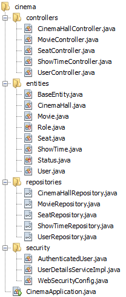
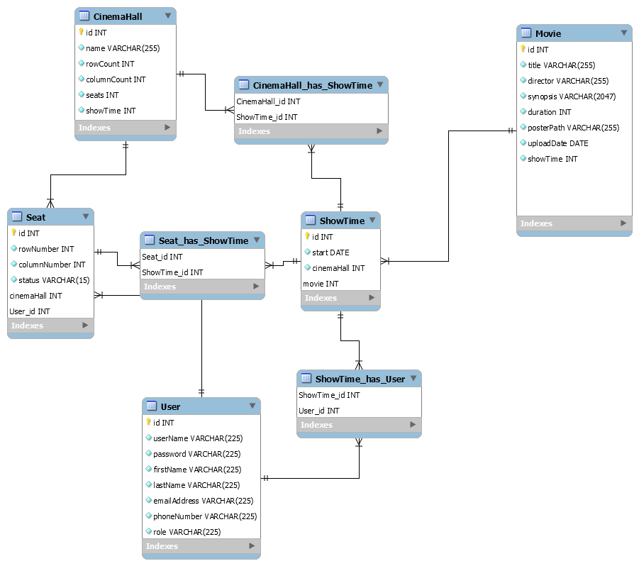
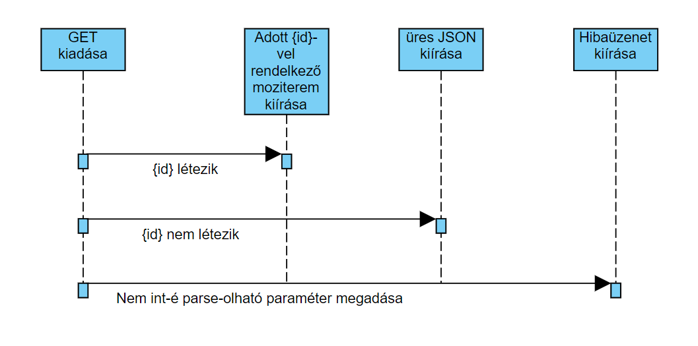

## Hegedüs Norbert (D89B81) - Kovács Tamás (JP56X5): Mozi
### Készítsünk egy mozi üzemeltető rendszert, amely alkalmas az előadások, illetve jegyvásárlások kezelésére

#### A webes felületen keresztül a nézők tekinthetik meg a moziműsort, valamint rendelhetnek jegyeket.
- A főoldalon megjelenik a napi program, azaz mely filmeket mikor vetítik a
moziban, valamint kiemelve az öt legfrissebb (legutoljára felvitt) film plakátja.
- A filmet kiválasztva megjelenik annak részletes leírása (rendező, főszereplők,
hossz, szinopszis), plakátja, továbbá az összes előadás időpontja.
- Az időpontot kiválasztva lehetőség nyílik helyfoglalásra az adott előadásra.
Ekkor a felhasználónak meg kell adnia a lefoglalandó ülések helyzetét (sor,
illetve oszlop, ügyelve a terem kapacitására). Egyszerre legfeljebb 6 jegy
foglalható, és természetesen csak a szabad helyek foglalhatóak (amelyek nem
foglaltak, vagy eladottak). A felhasználónak ezen felül meg kell adnia teljes
nevét, valamint telefonszámát, ezzel véglegesíti a foglalást.

#### A grafikus felületet az alkalmazottak használják a mozipénztárakban az előadások meghirdetésére, illetve jegyek kiadására.
- Új film felvitelekor ki kell tölteni a film adatait (cím, rendező, főszereplők,
hossz, szinopszis), valamint feltölthetünk egy képet plakátként.
- Új előadás meghirdetéséhez a felhasználónak ki kell választania a termet,
valamint a filmet, és az időpont megadásával hirdetheti meg az előadást. A
meghirdetéskor ügyelni kell arra, hogy az előadás ne ütközzön más
előadásokkal az adott teremben (figyelembe véve a kezdés időpontját, illetve
a film hosszát), illetve két előadás között legalább 15 percnek kell eltelnie a
takarítás végett.
- A jegyvásárláshoz ki kell választani a filmet és az előadást. Ezt követően
listázódnak a helyek (sor, oszlop, státusz). A szabad, illetve foglalt helyek
eladhatóak, illetve a foglalt helyeket kiválasztva meg lehet tekinteni a foglaló
adatait (név, telefonszám). 

#### Fejlesztői környezet és haszált technológiák:

- NetBeans IDE - BackEnd
- Visual Studio Code - FrontEnd
- GitHub:
	- SourceTree 
- MySQL Workbench - adatbázis-modell

- Angular keretrendszer
- Java Spring Boot
- MVC modell
- JSON

#### Könyvtárszerkezet:

#### Az adatbázis az alábbi adatokat tárolja: 
- filmek (cím, rendező, szinopszis, hossz, plakát, bevitel dátuma);
- termek (név, sorok száma, oszlopok száma);
- előadások (film, kezdő időpont, terem);
- helyek (előadás, terem, sor, oszlop, státusz <szabad, foglalt, eladott>, foglaló neve, foglaló telefonszáma);
- user (felhasználó név, jelszó, kereszt név, vezeték név, e-mail cím, telefonszám, szerepkörök <admin, alkalmazott, felhasználó>).

#### Szerepkörök:
 - Admin: Teljeskörű hozzáférése van mindenhez.
 - Alkalmazott: Előadások meghirdetése, jegyek kiadása
 - Felhasználó: Moziműsor megtekintése, jegyek foglalása
 
#### Adatbázis-terv (UML)

#### Végpontok
Entitások|Típus|Elérés|Leírás|Ki fér hozzá?
---|---|---|---|---
CinemaHall|GET|cinemahall/|Lekérdezi az összes mozitermet.|Mindenki
||GET|cinemahall/{id}|Lekérdez egy mozitermet azonosító alapján.|Mindenki
||POST|cinemahall/|Új mozitermet hoz létre.|Admin
||DELETE|cinemahall/{id}|Azonosító alapján mozitermet töröl.|Mindenki
||PUT|cinemahall/{id}|Azonosító alapján egy moziterem adatain módosít.|Mindenki
Movie|GET|movie|Lekérdezi az össze filmet.|Mindenki
||GET|movie/{id}|Lekérdez egyetlen filmet azonosító alapján.|Mindenki
||POST|movie/|Új filmet hoz létre.|Mindenki
||DELETE|movie/{id}|Azonosító alapján filmet töröl.|Mindenki
||PUT|movie/{id}|Azonosító alapján egy film adatain módosít.|Mindenki
Seat|GET|seat/|Lekérdezi az össze helyet.|Mindenki
||GET|seat/{id}|Lekérdez egyetlen helyet azonosító alapján.|Mindenki
||POST|seat/|Új helyet hoz létre.|Mindenki
||DELETE|seat/{id}|Azonosító alapján helyet töröl.|Mindenki
||PUT|seat/{id}|Azonosító alapján egy hely adatain módosít.|Mindenki
ShowTime|GET|showtime/|Lekérdezi az össze vetítést.|Mindenki
||GET|showtime/{id}|Lekérdez egyetlen vetítést azonosító alapján.|Mindenki
||POST|showtime/|Új vetítést hoz létre.|Mindenki
||DELETE|showtime/{id}|Azonosító alapján vetítést töröl.|Mindenki
||PUT|showtime/{id}|Azonosító alapján egy vetítés adatain módosít.|Mindenki
User|GET|user/|Lekérdezi az összes felhasználót.|Mindenki
||GET|user/{id}|Lekérdez egyetlen felhasználót azonosító alapján.|Mindenki
||POST|user/|Új felhasználót hoz létre.|Mindenki
||DELETE|user/{id}|Azonosító alapján felhasználót töröl.|Mindenki
||PUT|user/{id}|Azonosító alapján egy felhasználó adatain módosít.|Mindenki

#### GET -> cinemahall/{id} (Szekvencia-diagramm)

### Felhasználói Dokumentáció

#### Állományok beszerzése
- Látogassunk el a https://github.com/Spiler98/AlkFejlBead oldalra
- Itt kattintsunk a "**Clone and Download**" gombra, és azon belül kattintsunk a "**Download as Zip**" gombra.
- A letöltött állományt csomagoljuk ki

#### Adatbázis futtatása NetBeans IDE-vel
- Nyissuk meg a NetBeans IDE-t
- Nyissuk meg a projektet
- A Projects menüben a project fájl legyen kijelőlve, utána kattintsunk a "**Debug project**" gombra.

#### Weboldal futtatása Visual Studio Code-al
- Nyissuk meg a Visual Studio Code-ot
- Nyissuk meg a Frontend mappát
- Nyissunk egy terminált, majd lépjünk a cinema mappába a **cd cinema** kóddal
- Írja be a következőket:
	- **npm install @angular/cli**
	- **npm install**
- Futassa a weboldalt a **ng serve** paranccsal

#### Weboldal elérése:
- Nyisson egy böngészőt
- Írja be a címsorba, hogy **localhost:4200**

